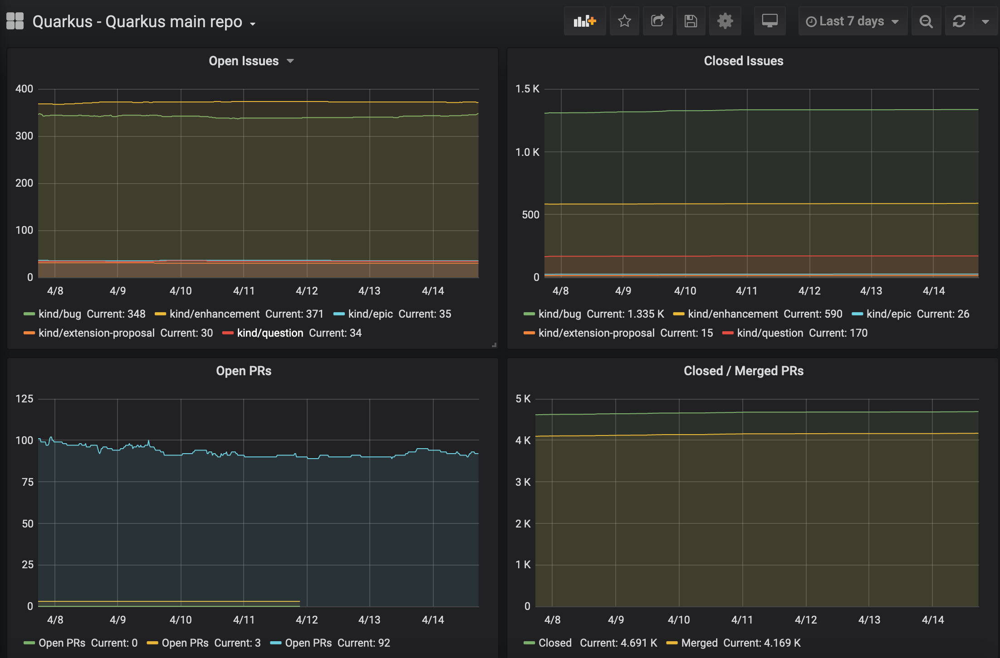
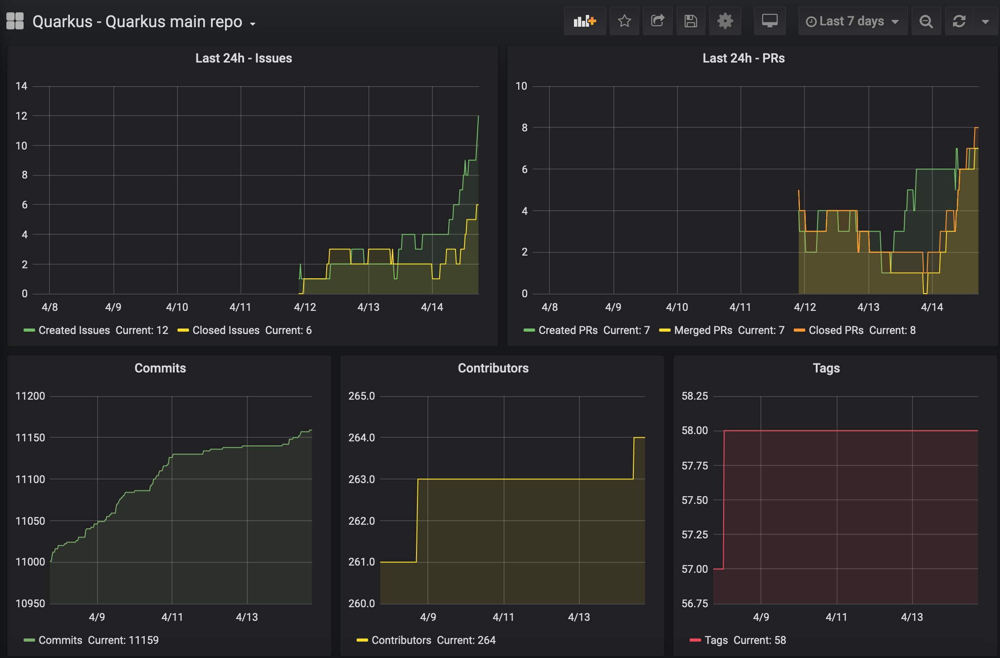
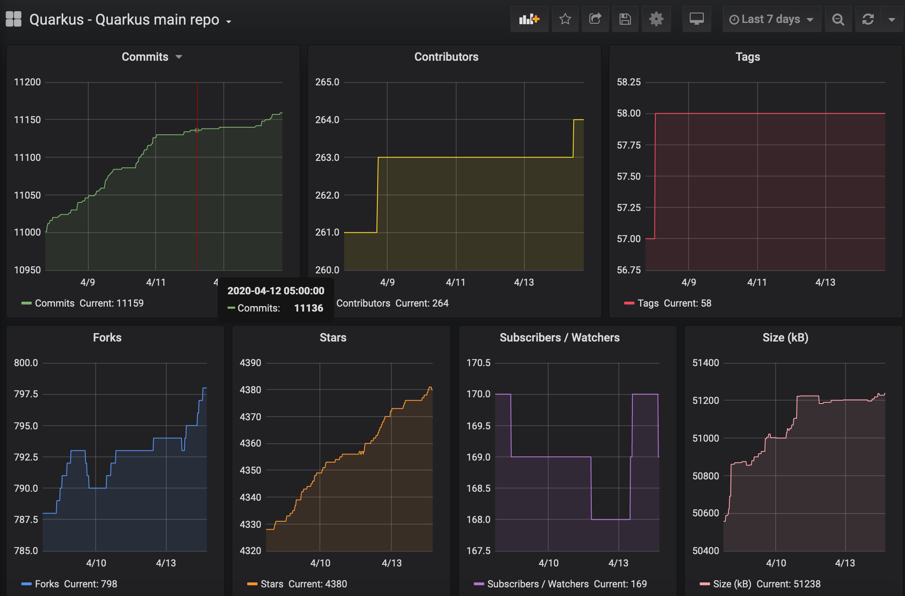

# gh-jira-metrics
A docker based stack to collect metrics from GitHub and JIRA

## Details
Prometheus + Grafana + 3 Quarkus based apps deployed via [docker-compose](docker-compose.yml). This stack runs on VM with just 2GB of RAM.

Dashboards are predefined in [grafana/provisioning/dashboards/](grafana/provisioning/dashboards/)

GitHub metrics exporter is located here: https://github.com/rsvoboda/gh-exporter.

There are 3 levels of details provided by this exporter, details about provided metrics: https://github.com/rsvoboda/gh-exporter#metrics

In the current setup only the main Quarkus repo is exposed in verbose mode, the main reason for this is GitHub restrictions on the number of requests for Search API.

JIRA metrics exporter is located here: https://github.com/rsvoboda/jira-exporter.
At this stage, this exporter provides so-called release readiness metrics that track Blocker and Critical issues, documentation issues, regressions and issues for triage.

## Screenshots




## Configuration
Edit `docker-compose.yml` and set GH_TOKEN and GH_REPOS.

For token details see https://help.github.com/en/github/authenticating-to-github/creating-a-personal-access-token-for-the-command-line

## Execution
```
docker-compose up -d

docker-compose stop
docker-compose down
```